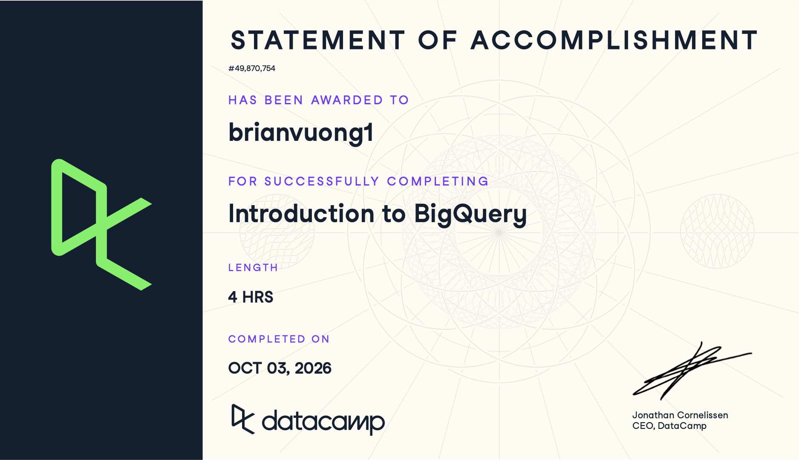

# Course-Completion Evidence

I completed the DataCamp Introduction to SQL course on November 25, 2025 (this was assigned from last year's IBM 6010 Fall 2025 course).




# Learning Notes and Key Takeaways

## BigQuery Architecture and Structure

### Main Ideas

This chapter introduced the overall structure of Google BigQuery and explained why it is designed for large-scale analytical queries. BigQuery is a cloud-based data warehouse that separates storage from computing resources, allowing large amounts of data to be stored and analyzed without managing traditional database servers.

Another important concept was how BigQuery organizes data. Data is organized into projects, datasets, tables, rows, and columns. Understanding this hierarchy is important because BigQuery queries usually reference tables by their project, dataset, and table names.

The chapter also compared BigQuery with traditional SQL databases. Although BigQuery uses SQL, it is designed primarily for analytical workloads involving large datasets rather than frequent small transactional operations.

### BigQuery Terminology or Procedures

- **Project:** The highest-level container for BigQuery resources. A project can contain multiple datasets.
- **Dataset:** A collection of related BigQuery tables and other objects.
- **Table:** A structured collection of data organized into rows and columns.
- **Schema:** The definition of the columns in a table, including their names and data types.
- **Data warehouse:** A system designed to store and analyze large amounts of structured data.
- **BigQuery architecture:** BigQuery separates data storage from query processing so computing resources can scale independently.
- **Fully qualified table name:** A table reference containing the project, dataset, and table names.
- **Columnar storage:** Data is stored by columns, which is efficient when analytical queries need only certain fields from a large table.

BigQuery data is generally organized in the following hierarchy:

`Project → Dataset → Table → Rows and Columns`

### Important SQL Syntax

A BigQuery table can be referenced using the following format:

```sql
`project_name.dataset_name.table_name`
```

Important SQL commands and clauses introduced or reinforced in this chapter include:

- `SELECT` — identifies the columns to return.
- `FROM` — identifies the table containing the data.
- Backticks `` ` ` `` — surround fully qualified BigQuery table names.
- `LIMIT` — limits the number of rows returned by a query.

### Example

```sql
SELECT
  customer_id,
  order_id
FROM `project_name.dataset_name.orders`
LIMIT 10;
```

In this example:

- `project_name` represents the Google Cloud project.
- `dataset_name` represents the BigQuery dataset.
- `orders` represents a table containing order information.
- `customer_id` and `order_id` represent columns in the table.
- `LIMIT 10` restricts the output to ten rows.

### Explanation

This query retrieves two fields from a BigQuery table and returns only the first ten rows. It demonstrates how BigQuery objects are referenced using the project, dataset, and table hierarchy.

Using a limited number of rows can be helpful when first exploring an unfamiliar table because it allows me to inspect the structure and values before writing a more complicated query.

### CEP Application

Understanding BigQuery's architecture would be useful in a CEP or digital marketing project because marketing data may come from several sources and contain a large number of records. For example, customer information, transactions, website activity, campaign data, and survey results could be stored in separate BigQuery tables within the same dataset.

Knowing how projects, datasets, and tables are organized would help me locate the correct data and create queries that combine or analyze the information needed for a marketing analysis.


## Writing Queries and Data Types

### Main Ideas

This chapter focused on writing queries in BigQuery and reviewing important SQL concepts. I learned how to retrieve information from tables, calculate values, combine tables with joins, and work with different data types.

The chapter also introduced data ingestion, which is the process of loading external data into BigQuery. BigQuery supports multiple file formats and provides tools for creating tables from uploaded data.

Another major topic was working with dates and timestamps. Date and time information is especially important when analyzing trends, determining reporting periods, or filtering data to a specific range.

### BigQuery Terminology or Procedures

- **Data ingestion:** The process of loading data into BigQuery.
- **Data type:** Defines the type of value stored in a field, such as text, numbers, dates, or timestamps.
- **STRING:** Stores text values.
- **INT64:** Stores integer values.
- **FLOAT64:** Stores decimal numeric values.
- **BOOL:** Stores `TRUE` or `FALSE` values.
- **DATE:** Stores a calendar date.
- **DATETIME:** Stores a date and time without a time zone.
- **TIMESTAMP:** Represents an exact point in time.
- **Load job:** A BigQuery operation that imports data into a table.
- **Join:** Combines related records from multiple tables.

One method for loading external data into BigQuery is the `LOAD DATA` statement. When loading information, the table schema and source data format need to be considered.

### Important SQL Syntax

Important syntax from this chapter includes:

- `SELECT` — selects fields from a table.
- `FROM` — specifies the source table.
- `WHERE` — filters records.
- `JOIN` — combines rows from related tables.
- `ON` — defines the relationship between joined tables.
- `SUM()` — calculates a total.
- `DATE()` — works with date values.
- `FORMAT_DATE()` — formats dates for reporting.
- `FORMAT_TIMESTAMP()` — formats timestamp values.
- `CURRENT_TIMESTAMP()` — returns the current date and time.
- `BETWEEN` — filters values within a range.
- `LOAD DATA` — loads external data into a BigQuery table.

### Example

```sql
SELECT
  order_id,
  customer_id,
  order_date,
  order_value
FROM `project_name.dataset_name.orders`
WHERE order_date BETWEEN DATE('2026-01-01') AND DATE('2026-01-31');
```

In this example:

- `orders` represents an e-commerce order table.
- `order_id` identifies an order.
- `customer_id` identifies the customer who placed the order.
- `order_date` stores the date of the order.
- `order_value` stores the value of the order.
- `BETWEEN` limits the results to orders during January 2026.

### Explanation

This query returns orders that occurred during a specific date range. Date filters are useful because most business and marketing reports analyze activity during a defined reporting period.

For example, a company might want to examine orders from one month, compare campaign performance between two periods, or calculate sales for the previous 90 days.

### CEP Application

Date filtering and data ingestion would be especially useful for digital marketing and CEP analysis. Marketing data frequently contains dates and timestamps for customer visits, email interactions, advertisements, purchases, and conversions.

I could use BigQuery to load marketing data and then filter the records to analyze performance during a campaign period. For example, I could compare customer activity before and after a campaign or examine transactions that occurred during a specific month.


## Querying Data in BigQuery

### Main Ideas

This chapter focused on more advanced methods for querying and summarizing data in BigQuery. Major topics included common table expressions, aggregate functions, special BigQuery aggregation functions, and window functions.

Common table expressions make large queries easier to organize by creating temporary named result sets. Aggregation functions summarize multiple rows into useful statistics such as counts, totals, or averages.

The chapter also introduced BigQuery-specific aggregation techniques, including approximate statistical functions. These functions can improve query efficiency when working with very large datasets and an exact result is not necessary.

### BigQuery Terminology or Procedures

- **Common Table Expression (CTE):** A temporary named result set created with the `WITH` clause.
- **Aggregation:** Combining multiple rows to produce summary information.
- **Aggregate function:** A function such as `COUNT()`, `SUM()`, or `AVG()` that summarizes records.
- **`COUNTIF()`:** Counts rows that satisfy a specified condition.
- **`HAVING`:** Filters results after aggregation.
- **`ANY_VALUE()`:** Returns a value from a group when one representative value is needed.
- **`STRING_AGG()`:** Combines multiple string values into one string.
- **`ARRAY_CONCAT_AGG()`:** Combines arrays across rows.
- **Approximate functions:** Functions that estimate results efficiently when analyzing large datasets.
- **Window function:** Calculates values across related rows without collapsing those rows into a single grouped result.

### Important SQL Syntax

Important syntax includes:

```sql
WITH cte_name AS (
  SELECT ...
  FROM ...
)
SELECT *
FROM cte_name;
```

Other important functions and clauses include:

- `WITH` — creates a CTE.
- `COUNT()` — counts records.
- `COUNTIF()` — counts records meeting a condition.
- `SUM()` — calculates a total.
- `AVG()` — calculates an average.
- `MIN()` — finds the smallest value.
- `MAX()` — finds the largest value.
- `GROUP BY` — groups rows before aggregation.
- `HAVING` — filters grouped results.
- `ANY_VALUE()` — returns a representative value from a group.
- `STRING_AGG()` — combines strings.
- `APPROX_COUNT_DISTINCT()` — estimates the number of unique values.
- `OVER()` — defines the window used by a window function.

### Example

```sql
WITH customer_orders AS (
  SELECT
    customer_id,
    COUNT(*) AS total_orders,
    SUM(order_value) AS total_spent
  FROM `project_name.dataset_name.orders`
  GROUP BY customer_id
)

SELECT
  customer_id,
  total_orders,
  total_spent
FROM customer_orders
WHERE total_orders >= 5;
```

In this example:

- `customer_orders` is a common table expression.
- `customer_id` identifies each customer.
- `COUNT(*)` calculates the number of orders for each customer.
- `SUM(order_value)` calculates the total amount spent by each customer.
- `GROUP BY customer_id` creates one summary row for each customer.
- The final `WHERE` clause returns customers with at least five orders.

### Explanation

This query first creates a temporary summarized dataset using a CTE. The CTE calculates each customer's total number of orders and total spending.

The final query then filters the summarized data to find customers who placed at least five orders.

Using a CTE makes the query easier to read because the aggregation step is separated from the final filtering step.

### CEP Application

CTEs and aggregation functions could be useful for customer segmentation in a digital marketing or CEP project.

For example, I could summarize transaction data by customer and calculate:

- Total purchases
- Total revenue
- Average order value
- Number of transactions
- Number of active months
- Number of campaign responses

Customers could then be grouped into segments such as high-value customers, frequent customers, or inactive customers.

Approximate functions could also be useful when working with very large marketing datasets where a fast estimate is more useful than waiting for an exact result.


## Data Management and Optimization

### Main Ideas

This chapter focused on combining data, modifying data, and improving BigQuery query performance.

The chapter reviewed several types of joins, including `LEFT`, `RIGHT`, and `FULL OUTER` joins. It also introduced `CROSS JOIN` with `UNNEST`, which is useful when working with repeated or nested data in BigQuery.

Another major topic was Data Manipulation Language, or DML. DML statements allow records in BigQuery tables to be inserted, updated, or deleted.

The chapter also discussed query optimization. Because BigQuery processes large amounts of data, reducing the amount of data scanned can make queries faster and potentially reduce processing costs.

### BigQuery Terminology or Procedures

- **INNER JOIN:** Returns rows that have matching values in both tables.
- **LEFT JOIN:** Returns all rows from the left table and matching rows from the right table.
- **RIGHT JOIN:** Returns all rows from the right table and matching rows from the left table.
- **FULL OUTER JOIN:** Returns matching and nonmatching records from both tables.
- **CROSS JOIN:** Produces combinations of records and can be used with arrays.
- **UNNEST:** Converts elements in an array into individual rows.
- **DML:** Data Manipulation Language used to modify table records.
- **INSERT:** Adds records to a table.
- **UPDATE:** Modifies existing records.
- **DELETE:** Removes records.
- **Query optimization:** Techniques used to reduce the amount of data processed and improve query efficiency.
- **Partition filtering:** Restricting a query to particular portions of a partitioned table.

### Important SQL Syntax

Important join syntax includes:

```sql
SELECT
  a.customer_id,
  a.customer_name,
  b.order_id
FROM `project_name.dataset_name.customers` AS a
LEFT JOIN `project_name.dataset_name.orders` AS b
  ON a.customer_id = b.customer_id;
```

Important DML commands include:

```sql
INSERT INTO table_name
UPDATE table_name
DELETE FROM table_name
```

Important optimization techniques include:

- Selecting only the columns needed instead of always using `SELECT *`.
- Filtering rows with `WHERE`.
- Filtering partitioned tables using appropriate date or timestamp fields.
- Limiting the amount of data processed before joining large tables.
- Aggregating data when detailed individual records are not needed.

### Example

```sql
SELECT
  c.customer_id,
  c.customer_name,
  COUNT(o.order_id) AS total_orders,
  SUM(o.order_value) AS total_spent
FROM `project_name.dataset_name.customers` AS c
LEFT JOIN `project_name.dataset_name.orders` AS o
  ON c.customer_id = o.customer_id
WHERE o.order_date >= DATE_SUB(CURRENT_DATE(), INTERVAL 90 DAY)
GROUP BY
  c.customer_id,
  c.customer_name;
```

In this example:

- `customers` contains customer information.
- `orders` contains transaction information.
- `customer_id` connects the two tables.
- `LEFT JOIN` combines customer records with order records.
- `DATE_SUB()` calculates the date 90 days before the current date.
- `COUNT()` calculates the number of orders.
- `SUM()` calculates total spending.
- `GROUP BY` creates one summary result for each customer.

### Explanation

This query combines customer and order data and summarizes activity from approximately the last 90 days.

The query demonstrates several concepts from the chapter at the same time: joining tables, filtering dates, aggregating values, and limiting the analysis to records that are relevant to the question being asked.

Limiting the data being processed is an important optimization strategy because there is usually no reason to scan an entire historical dataset when the analysis only requires a specific period.

### CEP Application

Joins would be extremely useful for digital marketing and CEP analysis because customer information is often stored across several different tables.

For example, one table could contain customer profiles, another could contain purchases, another could contain website behavior, and another could contain marketing campaign responses.

Using joins, I could combine these sources using a common identifier such as `customer_id`. I could then calculate customer-level metrics and build a more complete view of customer behavior.

Query optimization would also become increasingly important as the amount of marketing data increases. Filtering the data before analyzing it could reduce unnecessary processing while making reports faster and easier to maintain.


# Overall Reflection and Future Reference

## Most Useful BigQuery Concepts or Procedures

The most useful concepts I learned were BigQuery's project-dataset-table structure, common table expressions, aggregation functions, joins, date filtering, and query optimization.

CTEs were especially useful because they make more complicated SQL queries easier to organize. Instead of trying to perform every calculation in one large query, I can divide the problem into smaller logical steps.

Joins and aggregation functions were also important because they allow information from different tables to be combined and summarized into useful business metrics.

## BigQuery Compared with Learning SQL Syntax

Using BigQuery involves more than learning SQL syntax. SQL provides the commands used to retrieve and analyze information, but BigQuery also requires understanding how cloud data is organized and processed.

For example, I need to understand projects, datasets, tables, schemas, data ingestion, nested data, and query processing in addition to knowing commands such as `SELECT`, `WHERE`, `JOIN`, and `GROUP BY`.

BigQuery is also designed for analyzing very large datasets, which makes query optimization and limiting the amount of data processed especially important.

## Most Challenging Concepts or Procedures

The more challenging concepts were common table expressions, the different join types, nested or repeated data with `UNNEST`, and some of the specialized BigQuery aggregation functions.

These concepts require thinking about how records are structured and how intermediate query results will change before the final output is produced.

Choosing the correct type of join can also be challenging because the output depends on whether unmatched records from either table should be included.

## Applications to Digital Marketing and CEP

BigQuery could support digital marketing analytics and CEP projects by providing a central location for storing and analyzing large amounts of customer and marketing data.

For example, BigQuery could be used to analyze:

- Customer purchase behavior
- Campaign performance
- Customer segments
- Website and GA4 activity
- Survey responses
- Customer lifetime value
- Order frequency
- Average order value
- Marketing channel performance
- Recent customer activity

A CEP project could combine several datasets and use SQL queries to transform individual records into useful customer-level metrics.

For example, I could join customer and transaction tables and then calculate each customer's total spending, number of purchases, and most recent purchase date. Those metrics could then be used for customer segmentation or marketing analysis.

## Concepts to Review in the Future

Some concepts and query patterns I expect to review again include:

- Common table expressions using `WITH`
- Multiple CTEs in the same query
- `LEFT`, `RIGHT`, and `FULL OUTER JOIN`
- `CROSS JOIN` with `UNNEST`
- `GROUP BY` and `HAVING`
- `COUNTIF()`
- `ANY_VALUE()`
- `STRING_AGG()`
- `ARRAY_CONCAT_AGG()`
- `APPROX_COUNT_DISTINCT()`
- Window functions using `OVER()`
- BigQuery date and timestamp functions
- DML statements such as `INSERT`, `UPDATE`, and `DELETE`
- Query optimization and reducing the amount of data scanned

These notes will give me a reference for both SQL syntax and BigQuery-specific procedures when I need to work with large datasets again.


# Appendix: Publication Links

- [GitHub Repository] https://github.com/brianvuong1/ibm-6500-sql-portfolio
- [Published Introduction to SQL Report]https://brianvuong1.github.io/ibm-6500-sql-portfolio/intro-to-bigquery.html 