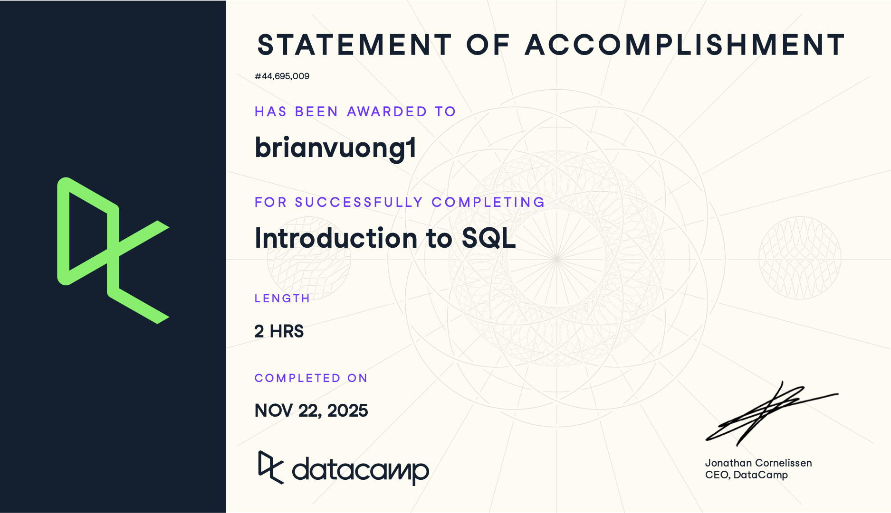

# Course-Completion Evidence

I completed the DataCamp Introduction to SQL course on November 25, 2025 (this was assigned from last year's IBM 6010 Fall 2025 course).



# Learning Notes and Key Takeaways

## Relational Databases

### Main Ideas

A relational database organizes information into tables made up of rows and columns. Each table usually represents a specific type of information, such as customers, products, transactions, or marketing campaigns. Tables can be related to one another through fields that they have in common.

One important idea from this chapter was that databases make it easier to store and organize large amounts of information in a consistent way. Instead of keeping all information in one large file, data can be separated into different tables and connected when needed.

I also learned that fields should have appropriate data types. The data type determines what kind of information can be stored in a column. For example, text can be stored as `VARCHAR`, whole numbers can use `INT`, and numbers with decimals can use a numeric data type such as `NUMERIC`.

Another important concept is having a unique identifier for records. A unique ID makes it possible to distinguish one record from another and can also help connect information between different tables.

### Important SQL Syntax and Terms

Some important terms and syntax from this chapter include:

- `SELECT` - chooses the columns or information to return.
- `FROM` - identifies the table where the data comes from.
- `*` - selects all columns from a table.
- `VARCHAR` - stores text or character data.
- `INT` - stores whole numbers.
- `NUMERIC` - stores numeric values, including values that may contain decimals.
- Unique identifier - a field whose value uniquely identifies each record.
- Table - a collection of related data organized into rows and columns.
- Field - a column within a table.
- Record - a row within a table.

### Example

```sql
SELECT *
FROM customers;
```

### Explanation of the Example

This query selects all columns and all records from the `customers` table. The asterisk (`*`) means that every field in the table should be included in the results.

This type of query can be useful when first exploring a database because it allows me to see what information is available. However, with a very large table, it may be better to select only the columns that are needed.

### CEP Application

Relational databases could be useful for a marketing or CEP project because marketing information often comes from several different sources. For example, one table could contain customer information, another could contain purchases, and another could contain advertising campaign results.

Understanding how the tables are organized would help me determine which fields are useful for my analysis. Choosing the correct data types would also help keep the data consistent. Unique customer or campaign IDs could be used to connect information from multiple tables without depending only on names or other fields that may contain duplicates.


## Querying

### Main Ideas

This chapter introduced the basic SQL commands used to retrieve information from a relational database. The `SELECT` statement specifies which fields I want to see, while the `FROM` clause tells SQL which table contains those fields.

I also learned how to use `DISTINCT` when I only want to see unique values instead of repeated values. This can be useful when exploring categories in a dataset, such as the different marketing channels, customer locations, or product categories that appear in a table.

Aliases make query results easier to understand by temporarily giving a column a more descriptive name. The `AS` keyword can be used to create an alias.

Another useful concept was a view. A view acts like a virtual table based on a saved query. Instead of storing another copy of the data, the database stores the query that produces the result. This can make frequently used queries easier to reuse.

I also learned that there are different SQL flavors. Most of the basic SQL commands are similar, but some syntax can vary between systems. For example, PostgreSQL uses `LIMIT` to restrict the number of rows returned, while SQL Server can use `TOP`. This means it is important to know which database system I am working with.

### Important SQL Syntax

Important commands from this chapter include:

- `SELECT` - selects one or more columns.
- `FROM` - specifies the table being queried.
- `DISTINCT` - removes duplicate values from the query results.
- `AS` - gives a column or result an alias.
- `CREATE VIEW` - saves a query as a reusable virtual table.
- `LIMIT` - limits the number of rows returned in PostgreSQL.
- `TOP` - can be used to limit results in SQL Server.
- `;` - marks the end of a SQL statement.

### Example 1: Selecting Specific Columns

```sql
SELECT customer_id, purchase_amount
FROM purchases;
```

### Explanation of the Example

This query retrieves only the `customer_id` and `purchase_amount` columns from the `purchases` table. Instead of returning every field in the database, the query returns only the information needed for the analysis.

For a marketing analysis, this could help me focus on specific variables instead of working with unnecessary columns.


### Example 2: Finding Unique Values

```sql
SELECT DISTINCT marketing_channel
FROM campaign_results;
```

### Explanation of the Example

This query returns each unique value from the `marketing_channel` column. If the table contains thousands of campaign records but only uses channels such as email, social media, search, and display advertising, each channel would appear only once in the result.

This is useful for quickly understanding what categories are present in a dataset.


### Example 3: Using an Alias

```sql
SELECT DISTINCT marketing_channel AS channel
FROM campaign_results;
```

### Explanation of the Example

This query retrieves the unique marketing channels and renames the result column from `marketing_channel` to `channel`. The alias does not permanently rename the original field. It only changes how the column is displayed in the query result.

Aliases can make output easier to read, especially when the original database contains long or technical field names.


### Example 4: Creating a View

```sql
CREATE VIEW unique_channels AS
SELECT DISTINCT marketing_channel AS channel
FROM campaign_results;
```

### Explanation of the Example

This query creates a view called `unique_channels`. The view contains a list of the unique marketing channels from the `campaign_results` table.

A view could be useful when the same query needs to be used repeatedly. Instead of rewriting the full query each time, I could access the saved view.


### Example 5: Limiting Query Results

```sql
SELECT customer_id, purchase_amount
FROM purchases
LIMIT 10;
```

### Explanation of the Example

This PostgreSQL query returns only the first 10 rows from the `purchases` table. Limiting results is useful when testing a query or exploring a large database because I can check whether the query works correctly without returning thousands or millions of records.

Different SQL systems may use different syntax for this task. For example, SQL Server commonly uses `TOP` instead of `LIMIT`.

### CEP Application

The querying skills from this chapter could be especially useful in a marketing analytics or CEP project. I could use `SELECT` to retrieve only the variables needed for an analysis, such as customer ID, campaign source, advertising cost, conversions, or purchase amount.

`DISTINCT` could help me identify the different customer segments, marketing channels, products, or geographic areas contained in a dataset. Aliases could make query results easier to understand when sharing results with other people.

Views could also be useful if I repeatedly need the same group of customers or campaign data. Instead of rewriting a complicated query each time, I could save it as a view and reuse it later.

Finally, limiting query results would allow me to test queries on a small number of records before running them against a much larger dataset. This could save time and make it easier to identify errors.


# Overall Reflection and Future Reference

The most useful skills I learned in the Introduction to SQL course were how relational databases organize information and how to retrieve specific information using SQL. Before learning SQL, I mainly thought about datasets as individual spreadsheets or files. The course helped me understand how databases can separate information into related tables and allow users to retrieve only the data they need.

The SQL commands that I found most useful were `SELECT`, `FROM`, `DISTINCT`, `AS`, and `LIMIT`. `SELECT` and `FROM` provide the basic structure for retrieving data, while `DISTINCT` is useful for identifying unique categories or values. I also found aliases helpful because they can make query results easier to read and understand.

One concept that may require additional practice is remembering differences between SQL flavors. Most basic SQL commands are similar across database systems, but certain commands can be written differently. For example, PostgreSQL uses `LIMIT` to restrict the number of results, while SQL Server can use `TOP`. I will need to pay attention to which SQL system I am using when writing queries.

SQL could support digital marketing analytics by making it easier to work with large amounts of customer, transaction, advertising, website, or survey data. For example, I could use SQL to retrieve campaign results, identify unique marketing channels, organize customer information, or prepare data for additional analysis. For a CEP project, SQL could help me obtain the specific variables and records needed for research instead of manually working with an entire database.

In the future, I expect to review SQL syntax as I learn more advanced commands. I will probably return to `SELECT`, `DISTINCT`, aliases, views, and differences between SQL flavors as a reference. I also expect that the basic ideas from this course will become more important when I begin working with filtering, calculations, grouping, and combining multiple tables in later SQL courses.

# Appendix: Publication Links

- [GitHub Repository] https://github.com/brianvuong1/ibm-6500-sql-portfolio
- [Published Introduction to SQL Report]https://brianvuong1.github.io/ibm-6500-sql-portfolio/introduction-to-sql.html 

